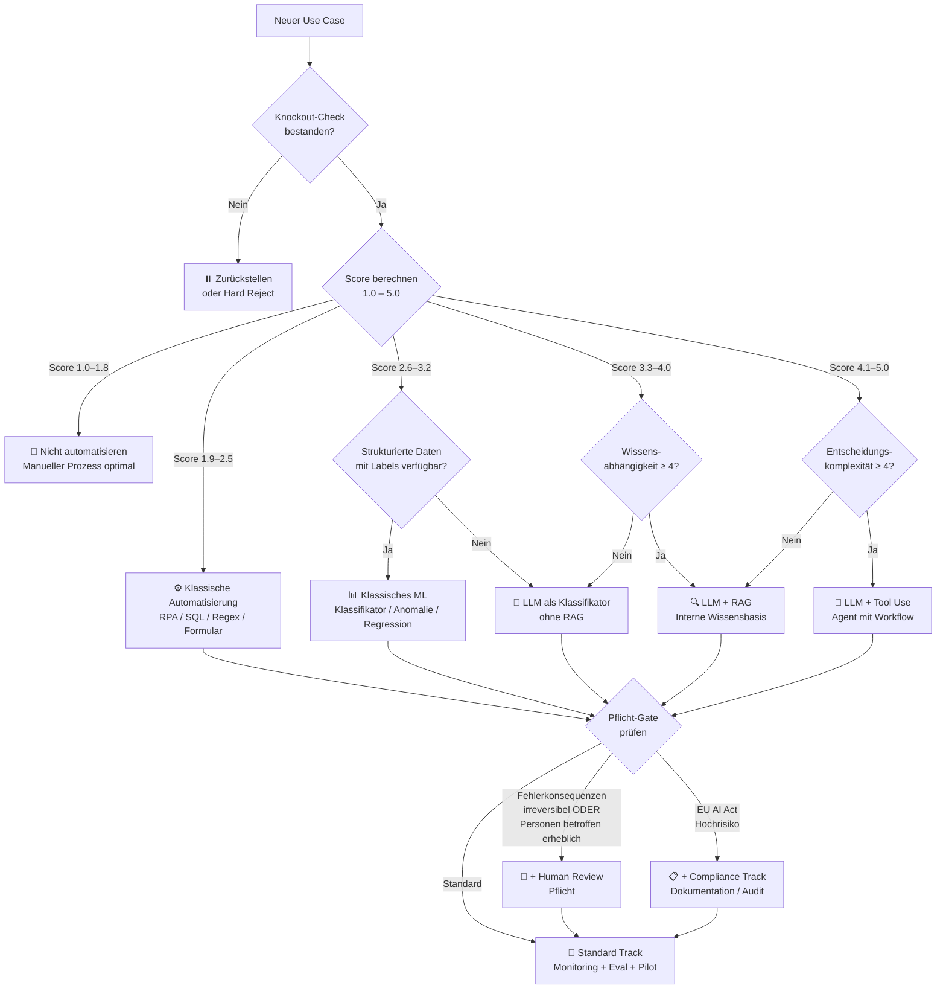

# AI Decision Framework
## AI Efficiency Control Tower — [Anonymisiert]

**Version:** 2.0
**Stand:** Mai 2026
**Autor:** AI Efficiency Control Tower
**Zielgruppen:** Internes Gremium, Fachbereiche, Engineering, Compliance

---

## 1. Executive Summary

> Für das Internes Gremium und das Management — Lesedauer: 2 Minuten.

**Das Problem:** Unternehmen setzen AI ein, ohne zu prüfen ob AI die richtige Antwort ist. Das Ergebnis: teure Projekte, die klassische Automatisierung ersetzen hätten sollen — oder AI-Projekte ohne ausreichende Governance, die an Compliance-Anforderungen scheitern.

**Dieses Framework** liefert eine strukturierte Entscheidungslogik, um AI-Anfragen in drei Schritten zu bewerten:

1. **Knockout-Check**: Ist der Use Case überhaupt reif für Automatisierung?
2. **Scoring-Matrix**: Welcher Automatisierungsansatz ist richtig (Regeln, ML, LLM, Agent)?
3. **Governance-Gate**: Welche Compliance- und Review-Prozesse sind verpflichtend?

**Kernprinzip:** AI ist nicht das Standardwerkzeug. Sie ist das richtige Werkzeug für spezifische Probleme — unstrukturierte Eingaben, kontextabhängige Urteile, umfangreiches internes Wissen. Für alles andere ist klassische Automatisierung schneller, günstiger und verlässlicher.

**Relevante Rechtsrahmen für die [Anonymisiert]:**
- DSGVO Art. 22: Verbietet rein automatisierte Entscheidungen mit erheblicher Wirkung auf Personen — ohne explizite Rechtsgrundlage und substanzielle menschliche Überprüfung.
- EU AI Act (in Kraft seit August 2024): Klassifiziert HR-, Recruiting- und bestimmte IT-Use-Cases als Hochrisiko-Systeme. Kernpflichten für Hochrisiko-Systeme ab August 2026 durchsetzbar. Bußgelder bis 35 Mio. € oder 7% Jahresumsatz.

---

## 2. Leitprinzip

> **AI für Ambiguität. Regeln für Klarheit. Menschen für Verantwortung.**

| Situation | Richtiger Ansatz |
|---|---|
| Klare Regeln, strukturierte Daten | Klassische Automatisierung (RPA, SQL, Regex) |
| Unstrukturierter Text, variabel, kontextabhängig | LLM |
| Muster in strukturierten Daten, statistisch | Klassisches ML |
| Internes Wissen als Quelle nötig | LLM + RAG |
| Entscheidung betrifft Personen erheblich | Human Review Pflicht |
| Prozess nicht definiert, Daten fehlen | Zurückstellen |

---

## 3. Verbesserte Decision Matrix

### Schritt 1: Knockout-Check (vor dem Scoring)

Beantworte diese vier Fragen. Jedes "Nein" stoppt die Evaluation bis zur Klärung.

| # | Frage | Wenn Nein → |
|---|---|---|
| K1 | Ist der Prozess klar definiert und dokumentiert? | **Zurückstellen:** Prozess zuerst strukturieren |
| K2 | Sind ausreichend und qualitativ verwertbare Daten vorhanden (oder beschaffbar)? | **Zurückstellen:** Data Foundation zuerst |
| K3 | Ist der Use Case kein verbotenes AI-System nach EU AI Act (z.B. Emotionserkennung am Arbeitsplatz, Social Scoring)? | **Hard Reject:** Rechtlich nicht zulässig |
| K4 | Gibt es ein klares Erfolgskriterium, an dem das System gemessen werden kann? | **Zurückstellen:** Zieldefinition zuerst |

### Schritt 2: Scoring-Matrix

Bewerte jeden Bereich von 1–5 anhand der Beschreibungen. Trage die Punkte ein.

---

#### Kriterium 1: Unternehmenswert (Gewichtung: 20%)

| Score | Beschreibung |
|---|---|
| 1 | Adjustierte Einsparung < €500/Monat |
| 2 | €500 – €2.000/Monat |
| 3 | €2.000 – €5.000/Monat |
| 4 | €5.000 – €15.000/Monat |
| 5 | > €15.000/Monat |

> Berechnung: (Zeit_heute − Zeit_AI in h) × Häufigkeit/Monat × Nutzer × Stundensatz
> × Evidenzfaktor (Schätzung=0,5 / Beispiel getestet=0,8 / Validiert=1,0)
> × Adoptionsfaktor (Freiwillig=0,5 / Gefördert=0,75 / Pflicht=1,0)

---

#### Kriterium 2: Input-Unstrukturiertheit (Gewichtung: 20%)

| Score | Beschreibung |
|---|---|
| 1 | Vollständig strukturiert: Formulare, feste Datenbankfelder, klar formatierte Tabellen. |
| 2 | Überwiegend strukturiert, mit kleinen Freitext-Kommentaren. |
| 3 | Mix aus strukturierten Feldern und relevanten Freitextanteilen. |
| 4 | Überwiegend Freitext: E-Mails, Tickets, Berichte mit erkennbaren Mustern. |
| 5 | Vollständig unstrukturiert: Verträge, Gutachten, Gespräche, variable Dokumente. |

---

#### Kriterium 3: Entscheidungskomplexität (Gewichtung: 20%)

| Score | Beschreibung |
|---|---|
| 1 | Eindeutige Regel: Wenn X → Y. Keine Ausnahmen, keine Interpretation. |
| 2 | Wenige Regeln mit dokumentierten Ausnahmen, vollständig formulierbar. |
| 3 | Viele Regeln, kontextabhängig, Ausnahmen häufig — aber prinzipiell regelbar. |
| 4 | Regeln nicht vollständig formulierbar. Urteilsvermögen und Erfahrung nötig. |
| 5 | Reines Expertenwissen, kontextuelles Verstehen, keine Regeln beschreibbar. |

---

#### Kriterium 4: Wissensabhängigkeit (Gewichtung: 15%)

| Score | Beschreibung |
|---|---|
| 1 | Kein internes Wissen nötig. Öffentliche Information oder simple Berechnung reicht. |
| 2 | Einzelne interne Referenzen (z.B. ein Standard-Template), leicht verfügbar. |
| 3 | Mittlere Wissensabhängigkeit: Policies, Preislisten, Projekthistorie vorhanden. |
| 4 | Umfangreiche interne Wissenbasis nötig: Handbücher, Verträge, Präzedenzfälle. |
| 5 | Tiefes, schwer dokumentierbares Expertenwissen über Jahre aufgebaut. |

---

#### Kriterium 5: Datenqualität (Gewichtung: 15%)

| Score | Beschreibung |
|---|---|
| 1 | Keine verwertbaren Daten. Prozess kaum dokumentiert, kein Verlauf. |
| 2 | Wenige, inkonsistente Daten. Prozess dokumentiert, aber nicht standardisiert. |
| 3 | Ausreichende Datenlage. Prozess standardisiert, Daten größtenteils zugänglich. |
| 4 | Gute Datenlage. Sauber, zugänglich, ausreichend Volumen für Training/Evaluation. |
| 5 | Exzellente Daten. Sauber, vollständig, gelabelt, ausreichend für Eval-Sets. |

---

#### Kriterium 6: Volumen & Frequenz (Gewichtung: 10%)

| Score | Beschreibung |
|---|---|
| 1 | <10 Fälle/Monat. Manueller Aufwand minimal, Automatisierung kaum lohnenswert. |
| 2 | 10–50 Fälle/Monat. Manuell handhabbar, Automatisierung optional. |
| 3 | 50–200 Fälle/Monat. Automatisierung würde spürbar helfen. |
| 4 | 200–1.000 Fälle/Monat. Manuell kaum skalierbar. |
| 5 | >1.000 Fälle/Monat oder Echtzeit-Verarbeitung nötig. |

---

### Schritt 3: Score berechnen

```
Gewichteter Score = (K1×0,20) + (K2×0,20) + (K3×0,20) + (K4×0,15) + (K5×0,15) + (K6×0,10)

Ergebnis: 1,0 bis 5,0
```

**Scoring-Template:**

| Kriterium | Score (1–5) | Gewichtung | Gewichteter Wert |
|---|---|---|---|
| Unternehmenswert | __ | × 0,20 | = __ |
| Input-Unstrukturiertheit | __ | × 0,20 | = __ |
| Entscheidungskomplexität | __ | × 0,20 | = __ |
| Wissensabhängigkeit | __ | × 0,15 | = __ |
| Datenqualität | __ | × 0,15 | = __ |
| Volumen & Frequenz | __ | × 0,10 | = __ |
| **Gesamtscore** | | | **= ____** |

---

## 4. Entscheidungslogik und Schwellenwerte

### Primärempfehlung (aus Gesamtscore)

| Score | Primärempfehlung |
|---|---|
| 1,0 – 1,8 | **Nicht automatisieren.** Manueller Prozess ist optimal. |
| 1,9 – 2,5 | **Klassische Automatisierung.** Regeln, RPA, SQL, Formulare. |
| 2,6 – 3,2 | **Klassisches ML oder Hybrid.** Strukturierte Daten + Musterentkennung. |
| 3,3 – 4,0 | **LLM-Ansatz** (Modifier beachten, siehe unten). |
| 4,1 – 5,0 | **LLM Advanced** (RAG, Tool Use, Agent — Modifier beachten). |

### Modifier: Technologie-Feintuning

Wende diese Modifier auf die Primärempfehlung an:

| Bedingung | Modifier |
|---|---|
| Input-Typ ≤ 2 UND Entscheidungskomplexität ≤ 2 | Override auf Klassische Automatisierung, unabhängig vom Score |
| Score ≥ 3,3 UND Wissensabhängigkeit ≥ 4 | LLM → **LLM + RAG** |
| Score ≥ 4,1 UND Wissensabhängigkeit ≥ 4 UND Entscheidungskomplexität ≥ 4 | **LLM + Tool Use / Agent (mit Human Approval)** |
| Echtzeit-Anforderung < 200ms | Override gegen LLM (zu langsam) → Klassisch oder ML |
| Score ≥ 3,3 UND Klassisches ML ausreichend (strukturiert, Labels vorhanden) | Klassisches ML vor LLM prüfen — günstiger und deterministischer |
| Umsatzrelevanz = Ja (mit 1–2 Satz Begründung) | Business Value Score +1 (max. 5) |

### Pflicht-Gates: Risiko-Overlay (unabhängig vom Score)

Diese Gates gelten unabhängig vom Scoring-Ergebnis und können die Empfehlung ergänzen oder überschreiben.

| Bedingung | Pflichtmaßnahme |
|---|---|
| Use Case trifft Personen mit erheblichen Konsequenzen (Einstellung, Kündigung, Kredit, Zugang) | Human Review Pflicht. DSGVO Art. 22. Kein rein automatisierter Betrieb. |
| EU AI Act Hochrisiko (HR, Recruiting, kritische Infrastruktur, Kredit-Scoring) | Compliance Track. Dokumentation, Bias-Tests, Audit Log, Human Oversight Pflicht. Deadline: August 2026. |
| Fehlerkonsequenzen irreversibel oder existenziell (Rechtsverletzung, Personenschaden, Vertragsbruch) | Human Review immer. Eval-Set vor Deployment zwingend. Kein Produktivbetrieb ohne Monitoring. |
| Datenqualität ≤ 2 | Zurückstellen. Kein Deployment bis Datengrundlage gesichert. |
| Use Case betrifft sensible Datenkategorien (Gesundheit, Biometrie, politische Meinungen) | DPIA (Datenschutz-Folgenabschätzung) nach DSGVO Art. 35 vor Pilot. |

---

## 5. Entscheidungsbaum (Mermaid)



---

## 6. Outcome-Kategorien

| # | Kategorie | Wann | Beispiel (IT Consulting) |
|---|---|---|---|
| 1 | **Nicht automatisieren** | Score < 1,8; Prozess zu selten, kein Mehrwert | Einmalige interne Analyse für Vorstand |
| 2 | **Klassische Automatisierung** | Score 1,9–2,5; klare Regeln, strukturierte Daten | SAP-Datenexport nach Excel-Template |
| 3 | **Klassisches ML** | Score 2,6–3,2; strukturierte Daten, Muster erkennbar, Labels vorhanden | Anomalie-Erkennung in Zeiterfassungsdaten |
| 4 | **LLM als Klassifikator** | Score 3,3–4,0; unstrukturierter Text, kein internes Wissen nötig | SAP-Ticket-Priorisierung nach Dringlichkeit |
| 5 | **LLM + RAG** | Score 3,3+; internes Wissen als Quelle erforderlich | Policy-Fragen, Vertragsprüfung gegen interne Standards |
| 6 | **LLM + Tool Use / Workflow** | Score 4,0+; mehrstufige Aufgaben, externe Systeme | RFP-Analyse mit CRM-Lookup und Template-Generierung |
| 7 | **AI Agent mit Human Approval** | Score 4,1+; autonome Schritte, irreversible Aktionen | Angebotserstellung: Agent entwirft, Mensch genehmigt |
| 8 | **Human-only** | Compliance-Gate überschreibt; irreversible Konsequenzen | Vertragsunterzeichnung, Kündigung, Rechtsentscheidung |
| 9 | **Zurückstellen** | Knockout nicht bestanden; Prozess unklar; Daten fehlen | Neues Thema ohne historische Daten oder klaren Prozess |

---

## 7. Governance-Gates

### Fast Track (Pilot in 2 Wochen möglich)
- Score 1,9–3,5
- Kein Personenbezug mit erheblichen Konsequenzen
- Keine DSGVO Art. 22 Relevanz
- Keine EU AI Act Hochrisiko-Einstufung
- Fehlerkonsequenzen reversibel
- Eval-Set mit 20 Beispielen vor Deployment

### Standard Track (2–4 Wochen Setup)
- Score 3,5–4,5
- Begrenzte Personendaten, keine erheblichen Einzelfolgen
- Monitoring-Konzept vorhanden
- Eval-Set mit 50+ Beispielen
- LLM-as-Judge oder manuelle Quality-Checks definiert
- Cost-Tracking eingebaut

### Compliance Track (4–8 Wochen, Legal und Datenschutz involviert)
- EU AI Act Hochrisiko (z.B. HR, Recruiting)
- DSGVO Art. 22 relevant (automatisierte Entscheidung mit erheblicher Wirkung)
- DPIA nach Art. 35 erforderlich (vor Pilot)
- Bias-Tests für alle Outcome-Kategorien
- Audit Log Pflicht (Nachvollziehbarkeit jeder Entscheidung)
- Human Review substanziell (kein Rubber-Stamping — EDPB-Anforderung)
- Betriebsrat informieren und konsultieren (national je nach Standort)
- Eval-Set mit 100+ Beispielen, monatliche Überprüfung

### Hard Block (kein Deployment)
- EU AI Act verbotene Praktiken (Emotionserkennung am Arbeitsplatz, Social Scoring, Biometrische Massenüberwachung)
- Rein automatisierte Entscheidungen ohne Rechtsgrundlage nach Art. 22
- Fehlerkonsequenzen katastrophal + kein Human Review möglich
- Datenqualität kritisch und nicht behebbar

---

## 8. Beispielbewertungen: Fünf realistische Use Cases

### Use Case 1: SAP-Support-Tickets automatisch priorisieren

**Kontext:** ~800 interne SAP-Tickets/Monat. Aktuell manuell triagiert durch 2 Personen.

| Kriterium | Score | Begründung |
|---|---|---|
| Unternehmenswert | 4 | 2 FTE teilweise freigesetzt, schnellere Reaktionszeiten |
| Input-Unstrukturiertheit | 4 | Freitext-Betreff und Beschreibung, variabel |
| Entscheidungskomplexität | 3 | Priorisierungsregeln existieren, aber Ausnahmen häufig |
| Wissensabhängigkeit | 2 | Kategorien-Liste vorhanden, kein tiefes Wissen nötig |
| Datenqualität | 4 | 2 Jahre Ticket-History, Labels vorhanden |
| Volumen & Frequenz | 4 | 800/Monat — manuell nicht mehr effizient skalierbar |
| **Gesamtscore** | **3,5** | |

**Primärempfehlung:** LLM als Klassifikator
**Modifier:** Wissensabhängigkeit = 2 → kein RAG nötig
**Governance-Gate:** Standard Track
**Pflicht:** Keine Art. 22-Relevanz (kein Personenbezug mit erheblicher Wirkung). Eval-Set 50+ Tickets.
**Realbeispiel:** Ähnlich umgesetzt bei Atlassian Jira-Teams mit OpenAI Function Calling — Fehlerrate < 5% nach 4 Wochen Eval.

---

### Use Case 2: Ausschreibungen (RFPs) auf Eignung prüfen

**Kontext:** Sales-Team erhält ~30 RFPs/Monat. Vorab-Analyse ob [Anonymisiert] passt: 45–90 Min manuell.

| Kriterium | Score | Begründung |
|---|---|---|
| Unternehmenswert | 5 | >€20k/Jahr Zeitersparnis; bessere Conversion durch schnellere Reaktion |
| Input-Unstrukturiertheit | 5 | PDFs, Word-Dokumente, variabel in Länge und Struktur |
| Entscheidungskomplexität | 4 | Eignung hängt von Technologie-Stack, Branche, Volumen, Marge ab |
| Wissensabhängigkeit | 5 | Interne Kompetenzprofile, Referenzprojekte, Preismodelle |
| Datenqualität | 3 | 60+ historische RFPs mit Outcome vorhanden, aber nicht systematisch getaggt |
| Volumen & Frequenz | 3 | 30/Monat — messbar, aber noch manuell handhabbar |
| **Gesamtscore** | **4,3** | |

**Primärempfehlung:** LLM Advanced
**Modifier:** Wissensabhängigkeit = 5 → **LLM + RAG** (Kompetenzprofile, Referenzprojekte als KB)
**Governance-Gate:** Standard Track
**Pflicht:** Kein Art. 22. Eval-Set 30 RFPs mit bekanntem Ausgang. Human Review für finale Go/No-Go-Entscheidung empfohlen (nicht verpflichtend, aber sinnvoll bei >€100k-Deals).

---

### Use Case 3: AI-gestütztes Bewerbungsscreening

**Kontext:** HR möchte Bewerber-CVs automatisch vorfiltern und erste Passung bewerten.

| Kriterium | Score | Begründung |
|---|---|---|
| Unternehmenswert | 4 | Zeitersparnis Recruiter, schnellere Rückmeldung an Kandidaten |
| Input-Unstrukturiertheit | 5 | Freitext CVs, Anschreiben, variabel |
| Entscheidungskomplexität | 4 | Passung hängt von Kontext, Team, Projekt ab |
| Wissensabhängigkeit | 4 | Anforderungsprofile, Kompetenzrahmen, interne Rollen |
| Datenqualität | 3 | Vorliegende CVs gut, Labels (Einstellung/Ablehnung) nur teilweise |
| Volumen & Frequenz | 3 | 50–100 Bewerbungen/Monat je Stelle |
| **Gesamtscore** | **3,9** | |

**Primärempfehlung:** LLM + RAG
**Modifier:** Wissensabhängigkeit = 4 → RAG mit Anforderungsprofilen
**Governance-Gate:** ⚠️ **Compliance Track**
**Pflicht:**
- DSGVO Art. 22: Trifft zu, wenn Scoring/Vorfilterung allein über Einladung entscheidet. Human Review substanziell Pflicht (kein Rubber-Stamping).
- EU AI Act Annex III: Recruitment AI ist explizit Hochrisiko. Core-Pflichten ab August 2026: Dokumentation, Bias-Tests, Audit Log, Human Oversight.
- DPIA nach Art. 35: Erforderlich vor Pilot.
- Betriebsrat: Informationspflicht vor Einführung.
- **Empfehlung:** Nur als Unterstützungswerkzeug für Recruiter, nie als alleinige Entscheidungsgrundlage.

---

### Use Case 4: Anomalie-Erkennung in Zeiterfassungsdaten

**Kontext:** Finance möchte ungewöhnliche Timesheet-Muster erkennen (Projektbuchungen außerhalb Laufzeit, unplausible Stundenzahlen).

| Kriterium | Score | Begründung |
|---|---|---|
| Unternehmenswert | 3 | Compliance-relevanz, moderate Kosteneinsparung |
| Input-Unstrukturiertheit | 1 | Vollständig strukturiert: Datum, Projektcode, Stunden, Mitarbeiter-ID |
| Entscheidungskomplexität | 2 | Regeln definierbar, Ausnahmen bekannt |
| Wissensabhängigkeit | 2 | Projektlaufzeiten, Budget-Codes — strukturiert verfügbar |
| Datenqualität | 4 | 3 Jahre Zeiterfassungsdaten, sauber |
| Volumen & Frequenz | 4 | Tägliche Buchungen aller 3.300 Mitarbeiter |
| **Gesamtscore** | **2,7** | |

**Primärempfehlung:** Klassisches ML oder Hybrid
**Modifier:** Input-Typ = 1 + Entscheidungskomplexität = 2 → **Override: Klassische Automatisierung / Regelbasiert + Optional ML für statistische Ausreißer**
**Governance-Gate:** Standard Track
**Hinweis:** LLM wäre hier **falsch** — strukturierte Daten + klare Regeln. Isolation Forest oder einfache Regel-Engine (Buchung > 24h/Tag, Buchung nach Projektende) ist günstiger, schneller, erklärbarer. LLM würde Komplexität unnötig erhöhen.

---

### Use Case 5: Onboarding Q&A für neue Mitarbeitende

**Kontext:** IT möchte einen internen Q&A-Bot für neue Mitarbeitende, der Fragen zu Prozessen, Tools, HR-Policies beantwortet.

| Kriterium | Score | Begründung |
|---|---|---|
| Unternehmenswert | 3 | Entlastung HR und IT Helpdesk, bessere Mitarbeitererfahrung |
| Input-Unstrukturiertheit | 4 | Natürlichsprachige Fragen, variabel |
| Entscheidungskomplexität | 3 | FAQ bekannt, aber Ausnahmen häufig |
| Wissensabhängigkeit | 5 | Interne Handbücher, HR-Policies, IT-Dokumentation |
| Datenqualität | 3 | Handbücher vorhanden, aber teils veraltet oder inkonsistent |
| Volumen & Frequenz | 3 | 20–50 neue Mitarbeitende/Monat, je mehrere Fragen |
| **Gesamtscore** | **3,7** | |

**Primärempfehlung:** LLM + RAG
**Governance-Gate:** Standard Track (mit einer wichtigen Einschränkung)
**Pflicht:** Quellenangabe in jeder Antwort zwingend. Monitoring der Fehlantworten (Halluzinationen) monatlich. Klarer "Ich bin nicht sicher — wende dich an HR" Fallback.
**Hinweis Datenqualität:** Vor Deployment KB sauber machen: veraltete Dokumente entfernen, Versionskontrolle einführen. Schlechte KB = schlechte Antworten, unabhängig vom Modell.

---

## 9. Red Flags und typische Fehlentscheidungen

### Red Flags — sofort stoppen und prüfen

| Red Flag | Warum gefährlich |
|---|---|
| „Wir bauen einfach mal einen Pilot" ohne definierten Erfolgsmaßstab | Pilot wird nie beendet, läuft unbewertet in Produktion |
| AI-Output wird direkt in Folgesystem geschrieben ohne Review | Fehler pflanzen sich fort — besonders kritisch in SAP |
| Kein Eval-Set vor Produktivbetrieb | Qualitätsversprechen ohne Nachweis |
| LLM für strukturierte Daten mit klaren Regeln | Teurer, langsamer, weniger zuverlässig als eine Regel-Engine |
| RAG auf veralteter oder inkonsistenter Wissensbasis | Halluzinationen basieren auf falschen Quellen — schlimmer als kein RAG |
| Use Case betrifft Personenentscheidungen ohne Human Review | DSGVO Art. 22 Verletzung, EU AI Act Compliance-Risiko |
| Keine Quellenangabe bei LLM-Antworten in Compliance-Kontext | Aussagen nicht überprüfbar, rechtlich riskant |
| Prompts in Code hardcoded, keine Versionierung | Qualitätsveränderungen nicht nachvollziehbar |
| Kein Cost-Tracking bei LLM-Calls | Monatliche Kosten unkontrollierbar, kein Budget-Signal |

### Typische Fehlentscheidungen

| Fehlentscheidung | Was stattdessen sinnvoller wäre |
|---|---|
| GPT für Rechnungsbeträge aus standardisierten PDF-Formularen extrahieren | PDF-Parser + Regex (deterministisch, günstiger, schneller) |
| LLM Agent für SAP-Datenbankabfragen | SAP-API + strukturierte Abfrage |
| RAG-System aufbauen bevor bestehende Suche evaluiert wurde | Erst SharePoint/Confluence-Suche verbessern |
| Fine-Tuning vor erfolglosem Prompt Engineering | Prompt Engineering + RAG löst 95% der Fälle günstiger |
| Autonomen Agent für irreversible Aktionen (E-Mail senden, Auftrag buchen) | Human Approval Gate einbauen |
| KI-Bewertungssystem ohne Bias-Test in der Recruiting-Pipeline | Manuelle Prozesse bis Compliance-Track abgeschlossen |
| Streaming LLM für Batch-Prozesse über Nacht | Batch-API ohne Streaming (günstiger, kein UX-Bedarf) |

---

## 10. Fragenkatalog für neue Use Cases

Diese 15 Fragen müssen vor jeder AI-Initiative beantwortet werden.

**Business:**
1. Was kostet der aktuelle Prozess in Zeit und Geld pro Monat?
2. Was ist das konkrete, messbare Ziel der Automatisierung?
3. Wer ist der Business Owner — wer entscheidet über Deployment und Abschaltung?
4. Was passiert, wenn das System falsch liegt? Wer trägt die Konsequenz?

**Daten:**
5. Welche Daten stehen zur Verfügung? Wo liegen sie, wer hat Zugriff?
6. Wie ist die Datenqualität? Gibt es Labeling oder historische Outcomes?
7. Enthält der Use Case personenbezogene oder sensible Daten?

**Technisch:**
8. Wie strukturiert oder unstrukturiert sind die Inputs?
9. Ist die Entscheidungslogik vollständig als Regel formulierbar?
10. Welche Latenzanforderung gibt es (Echtzeit / Batch / Stunden)?
11. Wie wird die Qualität des Systems gemessen? Was ist der Erfolgsmaßstab?

**Compliance:**
12. Trifft der Use Case Entscheidungen mit erheblicher Wirkung auf einzelne Personen?
13. Ist der Use Case unter EU AI Act Hochrisiko einzustufen?
14. Ist eine DPIA erforderlich (Art. 35 DSGVO)?

**Organisation:**
15. Gibt es ausreichend Change-Management-Kapazität für Schulung und Einführung?

---

## 11. Technische Umsetzung im AI Efficiency Control Tower

Dieses Framework ist nicht nur ein Dokument — es ist die Grundlage für die Triage-Engine des Control Towers.

### Direkte Code-Abbildung

| Framework-Element | Code-Artefakt | Woche im Plan |
|---|---|---|
| Knockout-Check | `domain/triage_engine.py` — KnockoutValidator-Klasse | Woche 5 |
| Scoring-Matrix | `domain/triage_engine.py` — WeightedScorer | Woche 5 |
| Modifier-Logik | `domain/ai_vs_automation.py` — DecisionModifier | Woche 6 |
| Risk-Overlay (Gates) | `domain/risk_scorer.py` — ComplianceGate | Woche 6 |
| Outcome-Mapping | `domain/models.py` — RecommendedApproach Enum | Woche 4 |
| Input-Validierung | `domain/models.py` — UseCaseInput mit Pydantic V2 | Woche 4 |
| Governance-Gate-Logik | `application/triage_service.py` — GovernanceRouter | Woche 7 |

### Datenmodell-Empfehlung

Das Scoring sollte im Intake-Formular als strukturierte Pydantic-Felder abgebildet werden:

```python
class TriageScores(BaseModel):
    business_value: Annotated[int, Field(ge=1, le=5)]
    input_unstructuredness: Annotated[int, Field(ge=1, le=5)]
    decision_complexity: Annotated[int, Field(ge=1, le=5)]
    knowledge_dependency: Annotated[int, Field(ge=1, le=5)]
    data_quality: Annotated[int, Field(ge=1, le=5)]
    volume_frequency: Annotated[int, Field(ge=1, le=5)]

    @computed_field
    @property
    def weighted_score(self) -> float:
        return (
            self.business_value * 0.20
            + self.input_unstructuredness * 0.20
            + self.decision_complexity * 0.20
            + self.knowledge_dependency * 0.15
            + self.data_quality * 0.15
            + self.volume_frequency * 0.10
        )
```

### LLM-Einsatz für die Triage selbst

Der Control Tower nutzt dieses Framework als Knowledge Base:
- Die Matrix ist in `knowledge_base/ai_governance/ai_decision_framework.md` versioniert
- Der Triage-LLM nutzt RAG über dieses Dokument, um den Scoring-Output zu begründen
- Jede Empfehlung enthält eine Quellenangabe auf die entsprechende Matrix-Zeile
- Der LLM-Output wird durch die rule-based Engine validiert: LLM kann Score nicht überschreiben, nur begründen

---

## 12. Quellen und reale Referenzen

| Quelle | Relevanz |
|---|---|
| EU AI Act, Annex III (Regulation EU 2024/1689) | Hochrisiko-Kategorienliste, inkl. HR/Recruiting |
| DSGVO Art. 22 — Automatisierte Entscheidungsfindung | Scope: "solely automated" + "legal or significant effects" |
| DSGVO Art. 35 — Datenschutz-Folgenabschätzung | DPIA-Pflicht bei Hochrisiko-Verarbeitung |
| EDPB Guidelines on Automated Decision-Making (WP251) | Präzisierung Art. 22 Scope; "rubber-stamping" zählt nicht als Human Review |
| NIST AI Risk Management Framework 1.0 (2023) | Govern / Map / Measure / Manage als Governance-Struktur |
| Anthropic, Building Effective Agents (2024) | Wann Agents sinnvoll vs. einfache LLM-Calls |
| OWASP LLM Top 10 (2025) | Prompt Injection, Halluzination, Excessive Agency als Risikofaktoren |
| Gartner AI Hype Cycle 2024/2025 | Reifegradeinschätzung verschiedener AI-Technologien |
| BCG, Build for the Future AI Study (2024) | 74% der Unternehmen sehen keinen realen ROI — häufig wegen fehlender Triage |
| McKinsey AI Index 2025 | 78% der Unternehmen nutzen AI; ROI-Gap durch fehlende Governance |

---

## 13. Was gegenüber v1 verbessert wurde

| Bereich | v1 | v2 |
|---|---|---|
| DSGVO Art. 22 | Falsch: „Personenbezug → Human Review Pflicht" | Korrekt: Nur bei solely automated + legal/significant effects |
| EU AI Act | Komplett fehlend | Vollständig integriert mit Hochrisiko-Kategorien und Deadlines |
| Scoring-Modell | Kriterienliste ohne Aggregationslogik | Gewichtetes Scoring 1–5, Schwellenwerte, Modifier-System |
| Outcome-Kategorien | 6 generische Kategorien | 9 differenzierte Kategorien inkl. Classical ML, Agent mit Human Approval |
| Decision Tree | Falsche Logik (Datenmenge als AI-Indikator) | Korrekter Baum mit Knockout-Check und Modifier-Logik |
| Classical ML | Komplett fehlend (Sprung von Regeln zu LLM) | Explizite Kategorie, mit Override-Logik für strukturierte Daten |
| Datenqualität | Nicht erwähnt | Knockout-Kriterium und eigenes Scoring-Feld |
| Latenz | Nicht erwähnt | Expliziter Override-Modifier gegen LLM |
| Governance-Gates | Keine Differenzierung | 4 Tracks: Fast / Standard / Compliance / Hard Block |
| Beispiele | Generisch | 5 Use Cases aus dem IT-Consulting-Kontext mit vollständigem Scoring |
| Fehlentscheidungen | Nicht vorhanden | 9 typische Fehlentscheidungen mit konkreten Alternativen |
| Fragenkatalog | Nicht vorhanden | 15 Pflichtfragen vor jeder AI-Initiative |
| Technische Abbildung | Nicht vorhanden | Direkte Mapping-Tabelle Code ↔ Framework + Pydantic-Datenmodell |
| Quellen | Blog-Posts | Regulatorische und wissenschaftliche Quellen |
