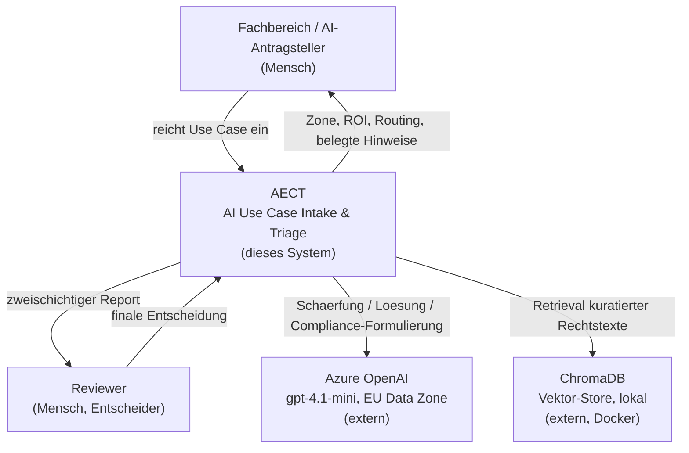
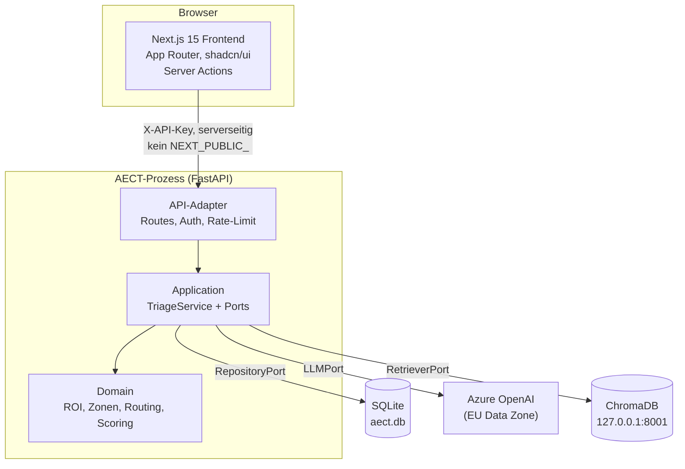
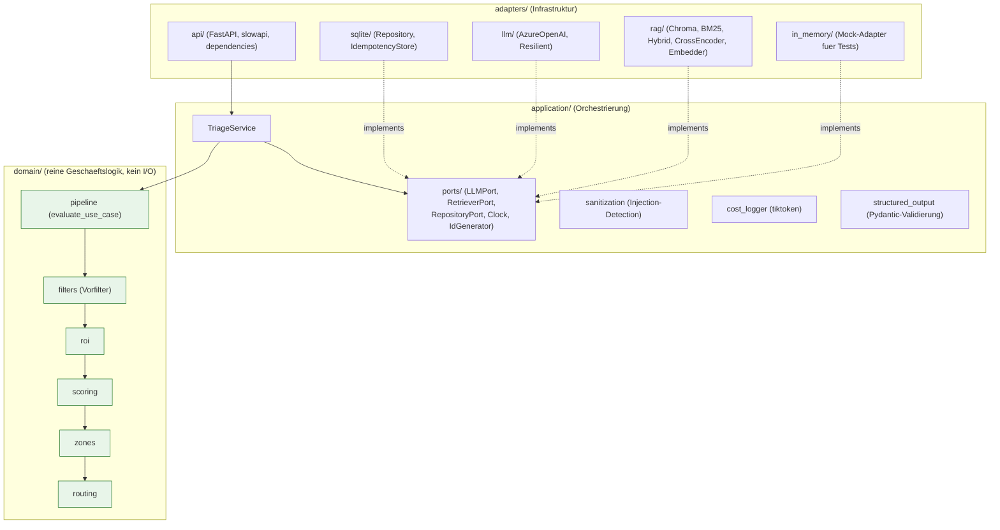
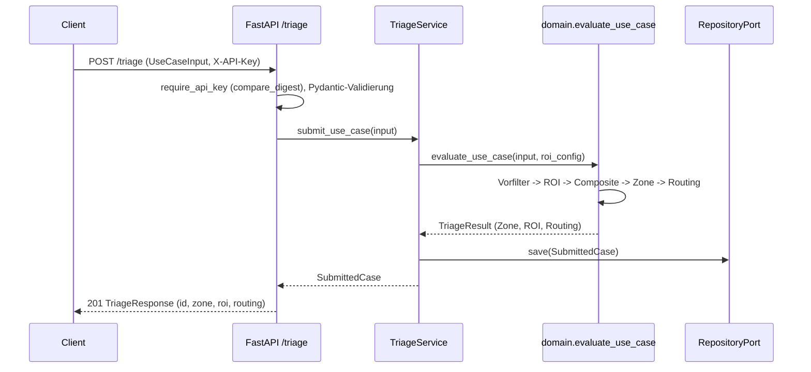
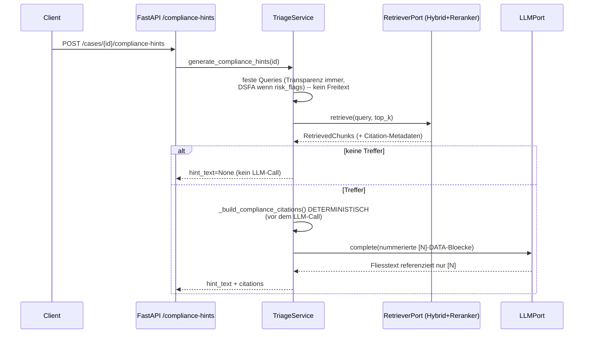
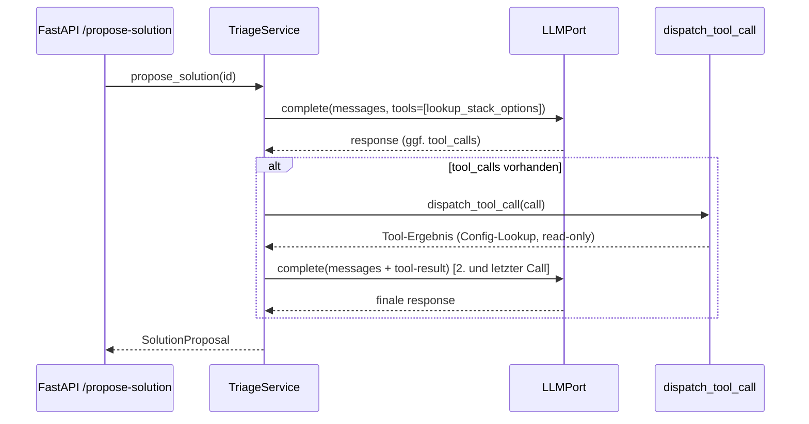

# Architecture Overview — AI Efficiency Control Tower (AECT)

**Version:** 1.1.0
**Stand:** Juni 2026
**Methodik:** C4-Modell (Context / Container / Component) + Sequenzdiagramme.

> Diagramme als versionierter Mermaid-Code (rendert auf GitHub). Architektur-
> Entscheidungen sind in `docs/adr/` (41 ADRs, Index: `docs/adr/README.md`)
> belegt -- dieses Dokument ist die Karte, die ADRs sind die Begruendungen.

---

## Problem

Unternehmen generieren laufend AI-Ideen aus Fachbereichen (HR, IT, Finance,
Sales, Legal). Es fehlt ein strukturiertes System, das diese Ideen vor der
Umsetzung bewertet -- nach Nutzen, Aufwand, Risiko, Datenschutz und der Frage,
ob es ueberhaupt ein AI-Problem ist. Ohne Triage landen zu viele Projekte in der
Umsetzung, oder sinnvolle Ideen werden mangels Bewertungskompetenz abgelehnt.

## Loesungsansatz

Ein Use-Case-Intake- & Triage-System nimmt interne AI-Anfragen strukturiert auf
und bewertet sie. Die Bewertung kombiniert deterministische Regel-Logik (ROI-
Modell, Composite-Score, 3-Zonen-Einstufung, AI-vs-Automation-Routing) mit
optionalem LLM-Einsatz (Schaerfung, Loesungsvorschlag) und RAG (belegte
Compliance-Hinweise). Zahlen kommen nie aus dem LLM.

**Leitprinzip:** Regeln vor LLM. AI fuer Ambiguitaet. Menschen fuer Verantwortung.

---

## C4 Level 1 -- System Context

AECT entscheidet nichts selbst: es liefert Entscheidungsunterstuetzung, der Mensch bleibt der Entscheider (Projekt-Prinzip Human-in-the-Loop).

---

## C4 Level 2 -- Container

Der API-Key liegt ausschliesslich serverseitig (Server Actions, kein
NEXT_PUBLIC_) -- der Browser sieht ihn nie (Threat-Model TB-5).

---

## C4 Level 3 -- Component (Hexagonal)

**Abhaengigkeitsregel (grep-verifiziert, CI-relevant):** `domain/` importiert nur
aus `aect.domain.*`; `application/` importiert nichts aus `adapters/`. Adapter
implementieren Ports via `typing.Protocol` (strukturelles Subtyping, kein Erben)
-- ADR-004.

---

## Sequenz 1 -- Triage (deterministisch, kein LLM)

Kein LLM-Call im Triage-Pfad -- die Zahlen sind deterministisch und testbar.

---

## Sequenz 2 -- RAG-Compliance (Citations-before-LLM)

Die Quellenliste wird aus den Retrieval-Metadaten gebaut, BEVOR das LLM
formuliert -- halluzinierte Artikel-Nummern sind strukturell ausgeschlossen,
nicht nur durch Prompt-Disziplin (ADR-0024).

---

## Sequenz 3 -- Function-Calling-Loop (begrenzt)

Maximal zwei `complete()`-Aufrufe, kein offener ReAct-Loop (LLM10/LLM06,
ADR-0009). Das einzige Tool ist read-only (`lookup_stack_options`).

---

## Kern-Komponenten (real, v1.1.0)

| Komponente | Aufgabe | Schicht |
|---|---|---|
| `pipeline.evaluate_use_case` | Orchestriert Vorfilter -> ROI -> Composite -> Zone -> Routing | domain |
| `roi` | v5-ROI-Modell (Potenzial x Adoption x Evidenz - Lizenz) | domain |
| `zones` | 3-Zonen-Einstufung + Handlungsdruck-Elevation | domain |
| `routing` | AI-vs-Automation-Signal-Routing, Risk-Flags | domain |
| `TriageService` | Orchestrierung + Persistenz, kennt nur Ports | application |
| `sanitization` | Prompt-Injection-Pattern-Detection (Flag, nicht Block) | application |
| RAG-Stack | Hybrid (BM25+Vektor, RRF) -> Cross-Encoder-Reranking | adapters/rag |
| `AzureOpenAIAdapter` | LLMPort, EU Data Zone, via ResilientLLMAdapter | adapters/llm |

---

## Bewusste Einschraenkungen (v1)

- SQLite statt Postgres -- privates Single-User-Build, Repository-Port als Ausstieg.
- ChromaDB lokal (`127.0.0.1:8001`) statt Azure AI Search -- kostenlos, isoliert.
- Azure OpenAI nur bei echten LLM-Operationen, Mock-First in Tests.
- Kein Produktivbetrieb, kein n8n, kein SaaS (Scope-Disziplin).

Vollstaendige, ehrliche Grenzen: `docs/known_limitations.md` (14 Punkte).
v2-Kandidaten: `docs/roadmap-v2.md`.
