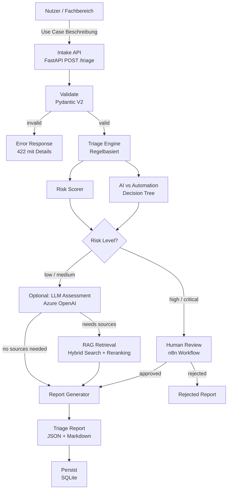

# Architecture Overview — AI Efficiency Control Tower

**Version:** 0.1 (Woche 1 Skizze — wird in Woche 7 zu C4 ausgebaut)
**Stand:** Mai 2026

---

## Problem

Unternehmen generieren laufend AI-Ideen aus verschiedenen Fachbereichen (HR, IT, Finance, Sales, Legal).
Es fehlt ein strukturiertes System, das diese Ideen bewertet — nach Nutzen, Kosten, Risiko, Datenschutz und technischer Umsetzbarkeit.
Ohne Triage landen entweder zu viele Projekte in der Umsetzung, oder sinnvolle Ideen werden mangels Bewertungskompetenz abgelehnt.

---

## Lösungsansatz

Ein Use Case Intake & Triage System nimmt interne AI-Anfragen strukturiert auf und bewertet sie automatisiert entlang definierter Dimensionen.
Die Bewertung kombiniert regelbasierte Logik (deterministisch, kostenlos) mit optionalem LLM-Einsatz (für Ambiguität) und RAG (für Richtlinien und Compliance).
Risikoreiche oder datenschutzrelevante Fälle werden automatisch zur menschlichen Prüfung eskaliert.

**Leitprinzip:** Regeln vor LLM. AI für Ambiguität. Menschen für Verantwortung.

---

## High-Level-Komponenten

| Komponente | Aufgabe |
|---|---|
| Intake | Strukturierte Aufnahme der Use-Case-Beschreibung (via API oder n8n-Formular) |
| Validate | Pydantic-Validierung aller Pflichtfelder und Enum-Werte |
| Triage Engine | Regelbasierte Bewertung (AI-Eignung, Privacy, Complexity, RAG-Need, Human-Review-Need) |
| Risk Scorer | 4-stufiges Risiko-Scoring (low/medium/high/critical) über 5 Risikodimensionen |
| AI-vs-Automation | Decision-Tree-Logik: wann AI, wann klassische Automatisierung |
| LLM Assessment | Optionaler LLM-Aufruf für qualitative Einschätzung (nur bei Bedarf) |
| RAG | Retrieval aus Knowledge Base (Governance, GDPR, Compliance) — nur wenn Quellen nötig |
| Report | Strukturierter Triage-Report mit Empfehlung, Risiken, Quellen, Kosten, Next Steps |
| Human Review | Eskalation bei high/critical Risk via n8n Workflow |
| Persistence | Speicherung aller Use Cases und Assessments (SQLite MVP) |

---

## Prozessfluss

---

## Bewusste Einschränkungen (MVP)

- SQLite statt Postgres — reicht für MVP, einfacher Betrieb
- ChromaDB lokal statt Azure AI Search — kostenlos, keine Cloud-Abhängigkeit
- n8n self-hosted via Docker — kein SaaS-Abo nötig
- Azure OpenAI nur bei echten Assessments, nicht in Tests (Mock-First)
- Kein Kubernetes — Azure Container Apps reicht für Demo

---

## Geplante Erweiterungen (ab Woche 7+)

- Hexagonal Architecture (Ports & Adapters)
- OpenTelemetry Tracing
- Semantic Caching
- MCP Server für Knowledge Base
- Azure Container Apps Deployment

---

*Nächste Version: C4-Diagramme (L1/L2/L3) in Woche 7*
